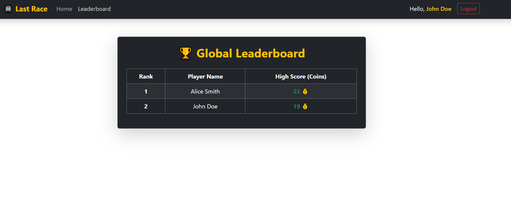
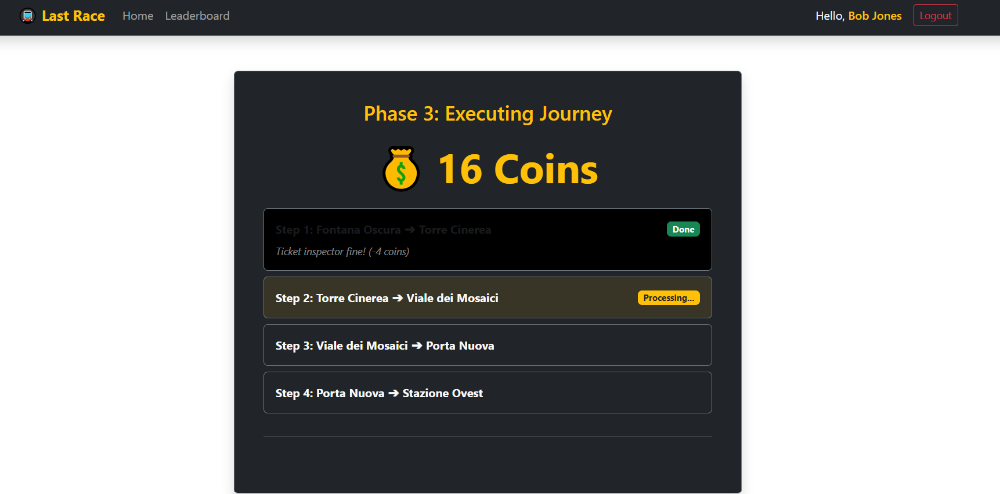

# Exam #1: Last Race

## Student

Sargol Majidian

## React Client Application Routes

* `/`: Displays the game instructions. Anonymous visitors can access this page, while authenticated users can start a new game.
* `/login`: Displays the controlled login form used to authenticate registered users.
* `/ranking`: Displays the best score achieved by each registered user. This route is protected.
* `/game`: Runs the complete game flow: Setup, Planning, Execution, and Result. This route is protected.

## API Server

### Authentication

* **POST `/api/sessions`**
  Authenticates a user through Passport and creates a session.

  Request body:

  ```json
  {
    "username": "john.doe@polito.it",
    "password": "password123"
  }
  ```

  Response body:

  ```json
  {
    "id": 1,
    "username": "john.doe@polito.it",
    "name": "John Doe"
  }
  ```

  Response status: `201`.

* **GET `/api/sessions/current`**
  Returns the currently authenticated user.

  Response body:

  ```json
  {
    "id": 1,
    "username": "john.doe@polito.it",
    "name": "John Doe"
  }
  ```

  Returns status `401` when no authenticated session exists.

* **DELETE `/api/sessions/current`**
  Logs out the current user and destroys the session.

  Response status: `204`.

### Network and Game Data

* **GET `/api/network`**
  Returns the complete underground topology, including line IDs, line names, station IDs, station names, and station positions on each line. This protected API is used to display the complete network during the Setup phase.

  Example response item:

  ```json
  {
    "line_id": 1,
    "line_name": "Red Line",
    "station_id": 1,
    "station_name": "Centrale",
    "position": 1
  }
  ```

* **GET `/api/stations`**
  Returns all stations with their computed interchange status.

  Example response item:

  ```json
  {
    "id": 1,
    "name": "Centrale",
    "is_interchange": 1
  }
  ```

* **GET `/api/segments`**
  Returns all unique physical segments as pairs of connected stations, without exposing the metro line serving them.

  Example response item:

  ```json
  {
    "from_id": 1,
    "from_station": "Centrale",
    "to_id": 5,
    "to_station": "Fontana Oscura"
  }
  ```

* **GET `/api/events`**
  Returns the available random journey events and their coin effects.

  Example response item:

  ```json
  {
    "id": 1,
    "description": "Quiet journey",
    "effect": 0
  }
  ```

* **GET `/api/ranking`**
  Returns the best score achieved by each user, ordered from the highest score to the lowest.

  Example response item:

  ```json
  {
    "user_id": 2,
    "name": "Alice Smith",
    "max_score": 23
  }
  ```

### Game Operations

* **GET `/api/game/setup`**
  Randomly assigns a starting station and a destination station. Their shortest network distance is guaranteed to be at least three segments.

  Example response:

  ```json
  {
    "startStation": {
      "id": 1,
      "name": "Centrale"
    },
    "targetStation": {
      "id": 9,
      "name": "Campo dell'Eco"
    }
  }
  ```

* **POST `/api/games/execute`**
  Receives the physical segments selected by the player in click order.

  Example request body:

  ```json
  {
    "segments": [
      {
        "from_id": 1,
        "to_id": 5
      },
      {
        "from_id": 5,
        "to_id": 8
      },
      {
        "from_id": 8,
        "to_id": 9
      }
    ]
  }
  ```

  The server reconstructs and validates the route. For a valid route, it randomly selects and applies one event for every segment. Invalid or incomplete routes receive a score of zero.

  Example valid response:

  ```json
  {
    "valid": true,
    "score": 22,
    "steps": [
      {
        "from": "Centrale",
        "to": "Fontana Oscura",
        "event": "Kind passenger found a coin",
        "effect": 1,
        "coins": 21
      },
      {
        "from": "Fontana Oscura",
        "to": "Torre Cinerea",
        "event": "Lucky day, vending machine malfunction",
        "effect": 2,
        "coins": 23
      },
      {
        "from": "Torre Cinerea",
        "to": "Campo dell'Eco",
        "event": "Metro delay, bought coffee",
        "effect": -1,
        "coins": 22
      }
    ]
  }
  ```

  Example invalid response:

  ```json
  {
    "valid": false,
    "score": 0,
    "steps": []
  }
  ```

All network, station, segment, event, ranking, setup, and game-execution APIs are protected and require an authenticated session.

## Database Tables

* `users`: Stores registered users, including their unique username, bcrypt password hash, and display name.
* `stations`: Stores the unique underground station names.
* `lines`: Stores the unique metro line names.
* `line_stations`: Associates stations with lines and records their sequential position on each line. Interchange stations are computed as stations belonging to more than one line.
* `events`: Stores the available journey event descriptions and integer coin effects between `-4` and `+4`.
* `games`: Stores completed game results, including the user, non-negative final score, and date.

## Main React Components

* `App`: Defines the application routes and renders the main application structure.
* `NavigationBar`: Displays navigation links and login or logout actions.
* `ProtectedRoute`: Prevents anonymous users from accessing the game and ranking routes.
* `AuthProvider`: Stores the authenticated user and checks the current server session.
* `HomeView`: Displays the game instructions and the game-start action for authenticated users.
* `LoginView`: Displays the controlled authentication form.
* `GameView`: Manages the Setup, Planning, Execution, and Result phases, including the 90-second timer and ordered segment selection.
* `MetroMap`: Renders the underground network as an SVG graph. The topology is retrieved from the server, while only the visual station coordinates are defined in the client.
* `RankingView`: Displays the highest score achieved by each registered user.

## Screenshot

### General Ranking



### Game



The screenshot files are stored in:

```text
client/public/screenshot_ranking.png
client/public/screenshot_game.png
```

## Users Credentials

| Username                | Password      | Initial history                   |
| ----------------------- | ------------- | --------------------------------- |
| `john.doe@polito.it`    | `password123` | Contains a successful seeded game |
| `alice.smith@polito.it` | `password123` | Contains a successful seeded game |
| `bob.jones@polito.it`   | `password123` | No seeded game history            |

## Use of AI Tools

AI assistance, including ChatGPT and Gemini, was used to support debugging, improve code organization, review route-validation logic, and refine the SVG network visualization.

The generated suggestions were manually inspected, adapted to the project database and API design, and tested through valid, invalid, incomplete, and timed-out game scenarios. Responsibility for understanding, verifying, and explaining the final implementation remains with the student.
